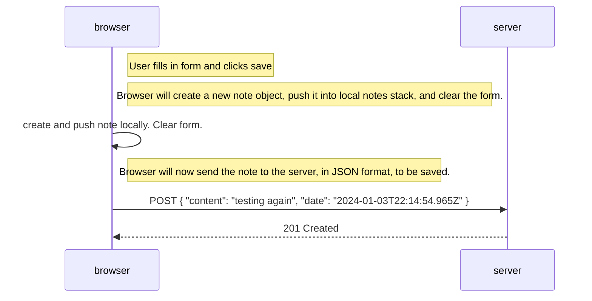

```mermaid
sequenceDiagram
    participant browser
    participant server

    Note right of browser: User fills in form and clicks save
    Note right of browser: Browser will create a new note object, push it into local notes stack, and clear the form.
    browser->>browser: create and push note locally. Clear form.

    Note right of browser: Browser will now send the note to the server, in JSON format, to be saved.
    browser->>server: POST { "content": "testing again", "date": "2024-01-03T22:14:54.965Z" }
    server-->>browser: 201 Created
```